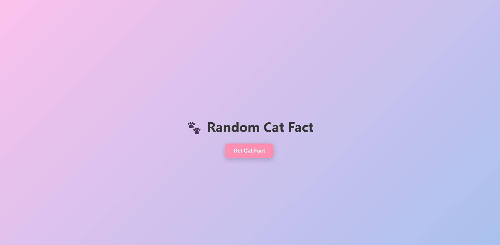
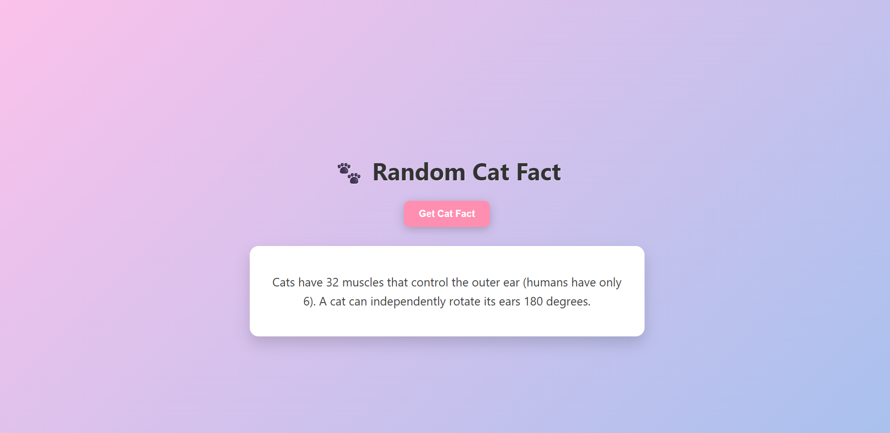

# Random Cat Fact App

A basic React app that retrieves and renders a random cat fact from the [catfact.ninja](https://catfact.ninja/fact) public API.

---
## Features

- Retrieves a random cat fact on button click
- Utilizes `async/await` for API queries
- Simple and minimal UI

---
##Installation

1. **Clone the repository:**

```bash
git clone https://github.com/your-username/cat-fact-app.git
cd cat-fact-app
```
2. **Install dependencies:**
   npm install
   
3.**Start the development server:**
   npm start

   Open http://localhost:3000 in your browser.

## 📸 Screenshots

Homepage of the Cat Fact App:



Button clicked showing a random fact:


